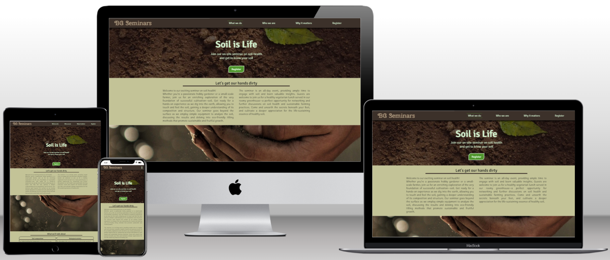
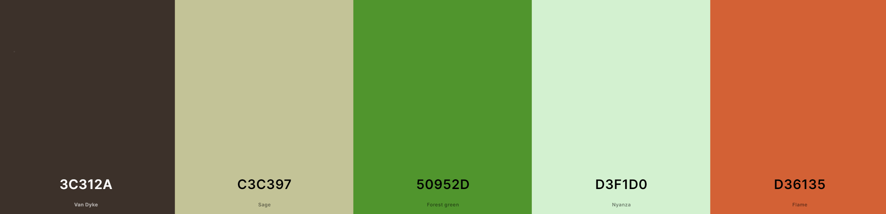

# Soil is Life project website

This project is an intuitive multi-page website informing visitors about a seminar on soil health that is held in Töreboda, Sweden. The main purpose of the site is to allow visitors to fill out a form and register for the upcoming seminar. The secondary purpose of the site is to inform visitors about the seminar organisers and to provide more information on the seminar topic, soil.

The website is fully responsive across multiple devices.

## Table of Contents
- [UX](#ux "UX")
    - [Target audience](#target-audience "Target audience")
        - [First-time visitors](#first-time-visitors "First-time visitors")
        - [Recurring visitors](#recurring-visitors "Recurring visitors")

## UX

### Target audience

The target audience of this website are hobby gardeners, market gardeners, and small-scale farmers who are looking to gain a profound understanding of soil. Visitors who land on this website have been directly searching for local seminars on soil health or for facts about soil and its importance.

#### First-time visitors

First-time visitors are greeted with a landing page that informs them in detail about the contents of the seminar. The information and the CTA button in the hero section make it unambiguously clear to them that they can register for a seminar on soil health. If they choose to scroll through the page and familiarize themselves with the seminar topics, they are presented with a second CTA button at the bottom of the page as well as clear information on when and where the seminar takes place and how much it costs.

The social media links in the footer allow the visitor to check out the organisers' reputation in social networks. 

#### Returning visitors

Returning visitors who already know that they want register for the seminar can use the CTA button in the hero section of the landing page to quickly get to the registration form. There, they also find the date and place of the next seminar as well as the amount of available places.

### Site purpose

The purpose of the site is to allow visitors to find information on the organisers' seminar and to register.

### Site goal

The goal of the site is to intrigue the target audience and spur them on to partake in the seminar on soil health. 

## Design

The website is built to be intuitive and user-friendly, with a clear and unambiguous navigation and easy-to-find information.

### Color scheme

The website uses earthy, natural tones:
- The navbar and the sections with registration form and info use #3C312A as their background color and #D3F1D0 as text color
- The navigation links and hero headings use #D3F1D0 as text color and #C3C397 as text shadow to appear slightly glowing
- The main page sections use #C3C397 as their background color and #3C312A as the text color
- Buttons and active navigation elements use #50952D to stand out
- The footer uses #D36135 as background color to set a colorful accent
- Variations of these colors are also present in the hero and background images of the site

### Typography

The website uses only two fonts:
- "Cherry Swash" for the logo in the  navbar
- "Signika Negative" for all other headings and texts on the site

### Images

The images were chosen to fit in with the website's overall look and to provide the visitor with a pleasant break inbetween the text paragraphs.

## Features

- Every page provides access to the navigation bar with links to the four pages and to the footer with links to social media pages
- On the landing page ("What we do"), the visitor can also:
    - read about the contents of the seminar
    - click the CTA button to get to the registration page
- On the "Who we are" page, the visitor can:
    - read about the organisers
    - find a small selection of the organisers' pictures
- On the "Why it matters" page, the visitor can:
    - read about the importance of the seminar topic in general
    - watch two embedded YouTube videos relevant to the seminar topic
    - click on external links to read more about the seminar topic on other websites 
- On the "Register" page, the visitor can:
    - find all important information on the next seminar
    - fill out and submit a registration form
- The "Thank you" page can only be accessed after successfully submitting the registration form; from there, the visitor can
    - return to the registration form via a button
    - use the navbar or the footer to navigate further

### Future features

- There should be a backend solution to save the form data
- The registration page contains a paragraph with information about still available places. The number that is shown to the user is wrapped in a span element with the id `open-seats` which could be used to automatically replace the number with the current value from a backend database.
- The same value should be used as the max amount for the input form labelled "Number of participants"

### Known bugs

- When scrolling through the landing page on a mobile, one can sometimes see the background images of the scroll-by sections jump or slightly change their size. So far, I was unable to fix this issue. 
- On the Why and About pages, in mobile view, paragraphs that are inside a div element with a class of `.reverse-order` have smaller left and right margins than the other paragraphs on those pages. I have yet to find the reason for that.

## Technologies

### Main languages

- HTML5
- CSS3

### Frameworks, Libraries, Applications

- GitHub: source control and project submission
- Chrome DevTools: debugging and responsiveness checks
- Google Fonts: all site fonts
- FontAwesome: social icons and info box symbols
- coolors.co: palette
- https://techsini.com/multi-mockup/index.php : responsiveness mockup
- unsplash.com : free images
- pexels.com : free images
- https://tinypng.com/ : image size reduction
- VS Code: IDE
- Krita: offline image editor

## Testing

- The site was tested with Chrome DevTools to ensure responsiveness on all devices and screen sizes
- The site was checked in the browsers Chrome and Opera

## Deployment

## Acknowledgments

